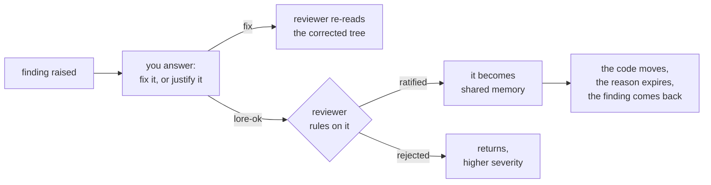
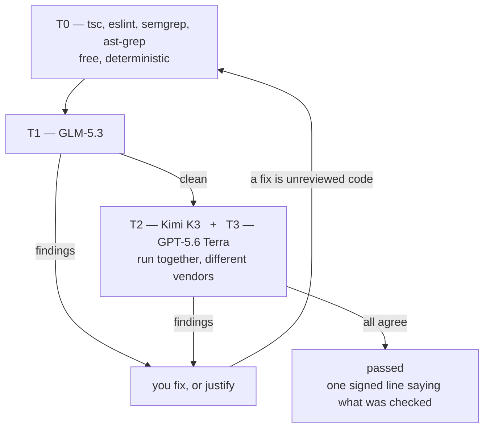
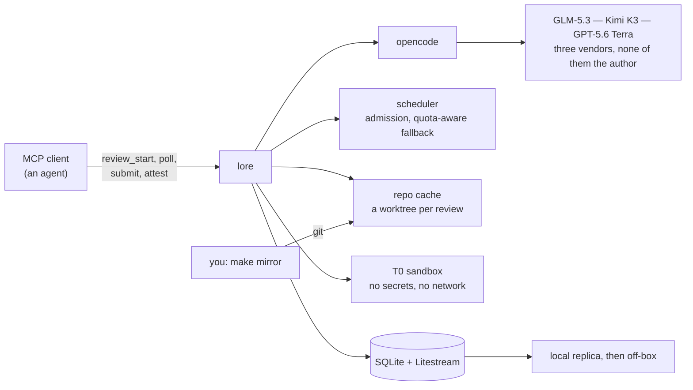

<div align="center">

# lore

### An independent code reviewer that **remembers your codebase between sessions**

*Reviews are the mechanism. The memory is the product.*

[](https://github.com/Vany/lore/actions/workflows/ci.yml)
[](src)
[](#what-it-has-actually-done)
[](package.json)
[](tsconfig.json)
[](spec/mcp-api.md)
[](LICENSE)

</div>

---

Every AI coding session starts amnesiac. It rediscovers the same conventions, re-raises
the same settled questions, and repeats the same mistake you corrected last week.

**`lore` is the memory.** It reviews a branch before it merges — with models that did not
write the code — and everything it learns doing so becomes a fact the next session already
knows.

<div align="center">

| | |
|:--|:--|
| 🧠 | **It remembers.** 544 live facts about six codebases, each with provenance and an expiry |
| 🔍 | **It disagrees with you.** 3,890 findings raised; 215 of your justifications rejected |
| 🚫 | **It never bluffs.** A review that did not run is never reported as one that found nothing |
| 🔒 | **It is not your author.** Every tier is a non-Anthropic model, enforced by absence |

</div>

---

## What a finding actually looks like

Not a nit about naming. This one is from lore reviewing **its own** commit, this morning:

> **`e8d3f8a3` · medium · `src/core/memory.ts:61`**
>
> **Claim.** SPEC D-151 says an unparseable `LORE_MIN_AVAILABLE_MB` *"refuses to start rather
> than falling back to the default"*, but nothing validates it at boot: `floorBytes()` throws
> lazily inside `review_start` and inside `checkHealth`. The startup-validation idiom for
> exactly this knob class exists 60 lines away and was not used.
>
> **Failure scenario.** Operator sets `LORE_MIN_AVAILABLE_MB=2g` — the SPEC's own example — and
> runs `make up`: the container starts green and answers `/healthz` 200, so the operator
> believes the value was accepted. In fact every `review_start` fails with an error shown only
> to client agents, `/status` answers 500, and the beat's only signal is deadman silence. **The
> monitor dies on the misconfiguration instead of reporting it.**
>
> **Asks.** *Fix this, or tell me why it is not a problem. Both are real answers, and I may be wrong.*

It read a sentence in a spec, checked it against the code, found the code narrower than the
claim, and traced what an operator would believe as a result. That is the class of defect
this is built to catch — **a false statement about a failure**, which is what nearly every
real bug in this repository has turned out to be.

---

## The idea that makes it work

When a reviewer raises something you believe is wrong, you do not argue in a comment
thread. You write the reason **in the code**:

```ts
// lore-ok[a1b2c3d4]: bounded by the caller's schema check at api/route.ts:31,
// so a negative amount cannot reach here.
export function capture(amount: number) { … }
```

That is *proposing a piece of lore*. The reviewer ratifies it — and your reason becomes
something the codebase knows about itself — or rejects it, and the finding returns at
**higher severity**, because a wrong justification is worse than a bug.



**The author never closes its own finding.** That single rule is what keeps the loop
honest: it terminates when the code is correct, not when the author gets persuasive.

And a justification **expires**. It was a claim about specific code; when that code changes
the reason may no longer hold. Live proof: **8,088 of this deployment's knowledge rows have
been retired** as their sources moved, against 544 still standing. Without that, a design
like this rots into rubber-stamping within months.

---

## The ladder

Deterministic tooling first — *a model should never be paid to decide what a typechecker
decides for free.* Then progressively dearer models, each seeing only code the previous
tier already passed.

| tier | engine | vendor | paid by |
|:--|:--|:--|:--|
| **T0** | the repo's own `tsc` · `eslint` · `cargo check`/`clippy` · `ast-grep` · `semgrep` | — | free |
| **T1** | GLM-5.3 | Z.ai | subscription |
| **T2** | Kimi K3 | Moonshot | subscription |
| **T3** | GPT-5.6 Terra | OpenAI | subscription |

Three tiers, **three vendors** — two tiers from one model family share blind spots and are
not two independent opinions.



**Every reviewer is a model that did not write the code.** That rules out the strongest
model on the board on purpose: a model reviewing its own output confirms the design it
already had in mind. It is enforced by *absence* — no Anthropic credential is ever deployed
to the reviewer.

**One paid route exists and it is off by default.** When a subscription hits its
billing-cycle limit the chain can reach the same model through OpenRouter, which bills per
call. The measured difference on this deployment is stark:

| route | calls | cost |
|:--|--:|--:|
| subscriptions | 4,458 | **$0** |
| metered fallback | 93 | **$230.53** |

`LORE_ALLOW_METERED` (default `0`) decides whether lore may walk onto one. At `0` the tier
is skipped and named in `checks_skipped` — a weaker review said out loud, rather than a bill
nobody chose.

---

## What it has actually done

Measured on the live deployment, **2026-09-17**, from the database rather than from memory:

<div align="center">

| | | | |
|--:|:--|--:|:--|
| **609** | reviews, over 5 weeks | **341** | reached a clean verdict |
| **3,890** | findings raised | **786** | of them high severity |
| **2,394** | findings fixed | **215** | justifications **rejected** |
| **544** | live facts remembered | **8,088** | retired as the code moved |
| **4,551** | model calls | **14.1B** | tokens |
| **6** | codebases | **4.1** | rounds per review |

</div>

**54 of those reviews were lore reviewing lore.** Most of what it has found, it found in
itself — and the shape of those findings is the reason the project has the shape it does:

> Nearly every real defect was a **false statement about a failure**, not a wrong algorithm
> — a review that timed out and reported clean, a cap that discarded a round someone paid
> for, a status command that guessed at why it had no status, a paste-able config that could
> never have been pasted. The ladder logic, the fingerprinting and the VEX mapping all worked
> first time. [`MEMO.md`](MEMO.md) has every one of them, including the retractions.

---

## Quick start

### As a CLI, on your laptop

```bash
npm ci
node ./src/index.ts review \
  --branch feat/holds --into main \
  --ticket "Release the hold when a capture declines"
```

Exit codes are the API, because the caller is usually a program:

| code | meaning |
|:--|:--|
| `0` | **passed** — cleared by the full ladder: every tier ran, each a distinct vendor |
| `3` | **passed_thin_ladder** — cleared, on a thinner ladder: a tier above the highest that ran never looked, or fewer vendors read the code than tiers ran |
| `1` | findings — fix or justify, then run again |
| `70` | **did not run** — never confuse with "found nothing" |
| `75` | quota exhausted — also not a pass |

`0` and `3` are **both** successes, and `3` is the *ordinary* one here — 287 of 341 clean
verdicts. They are separate so a caller that needs the full ladder can require `0`, and one
that only needs "the tiers that ran agreed" can accept either. A script treating `3` as
failure blocks on nearly every clean review; one treating it as `0` loses the distinction
the ladder exists to make. Choose deliberately.

### As a service, for a workgroup

```bash
cd deploy
cp .env.example .env          # three subscriptions by default, or one metered key
make sync-opencode            # stage local config, minus the Anthropic credential
make up
make new NAME=you GIT=git@github.com:you/repo.git   # token + the .mcp.json to paste
make mirror REPO=repo         # clone it once — out here, as you
make mirror-daemon            # ...and keep it fresh, so nobody has to remember
```

**lore never talks to a remote.** It holds no git credentials by design, so the fetch
happens on the host under your own agent and lands in a directory the container already
reads. Keeping that current is the *service's* job, not a person's (D-65): the client is an
agent on another machine with no shell here, and a stale mirror was once the single largest
cause of failed reviews.

Then point any MCP client at it. lore ships its own documentation — tool descriptions,
`lore://docs/*` resources and a `/lore:review` prompt that drives the whole loop — because
**the client is an agent, so the docs are the interface**.

### Stop your agent sleeping: run the channel

A review takes tens of minutes and a client has no way to know when it finished, so agents
bridge the gap with a fixed `sleep`. Measured here: a median of three minutes of dead
waiting per finding, **339 hours in total** — and no constant can be right, because a round
runs anywhere from twenty seconds to twenty-three minutes.

[`channel/lore-channel.ts`](channel/lore-channel.ts) is a
[Claude Code channel](https://code.claude.com/docs/en/channels): a small local process that
watches your reviews and pushes an event into your session the moment one needs you. The
polling still happens — it just happens somewhere that costs no model turns.

```json
{
  "mcpServers": {
    "lore-channel": {
      "command": "node",
      "args": ["--experimental-strip-types", "/path/to/rev/channel/lore-channel.ts"]
    }
  }
}
```

**No url and no token**: it reads them from the `lore` entry already in that same file,
because that is how Claude Code reaches lore at all and a second copy is one more thing to
drift. Then start Claude Code with it enabled — custom channels are not on the
research-preview allowlist, so during the preview this is the flag that loads it:

```bash
alias claude-lore='claude --dangerously-load-development-channels server:lore-channel'
```

There is no `settings.json` key for this, by design: a channel injects text into your
session, so Claude Code requires a per-session opt-in.

---

## Architecture



`tsc` and `eslint` run in a throwaway container, copied from a read-only mount of the
reviewed tree — they resolve their binaries out of the target's `node_modules`, so the
install runs, and an install runs lifecycle scripts. That container holds **no** credential,
no database and no signing key. lore does not execute a test suite at all (D-71): it reads
your tests and leaves running them to your CI.

---

## The rules it is built on

> ### A review that did not run is not a review that found nothing.

Every ambiguity resolves toward saying so loudly. Four reviews failing silently in a single
day is why this project has the shape it has.

- `failed`, `expired` and `fast_clean` are distinct states. **None of them is a pass.**
- An unparseable reply is a *failed* review — one retry, then loud failure.
- Quota exhaustion never falls through to another tier.
- The attestation says **what was checked**, never that the code is correct.
- A knowledge conflict stops the review and asks a person — and that block has an exit,
  because a stop with no way to clear it is a trap, not a safeguard.

---

## What is **not** proven

Stated plainly, because a checklist that hides its gaps is the failure this tool exists to
catch.

- **Real quota exhaustion has never executed.** `passed_thin_ladder` has, 287 times — this
  section claimed the opposite for weeks, which is exactly why the state kept being reasoned
  about as an exception.
- **`needs_human` has fired once, and it was wrong** — two ADR sentences restating one
  constraint, read as a contradiction. The lesson is the one worth repeating: a heuristic
  that escalates to a person must fail quiet, not loud.
- **A fresh session has never driven a review to `passed` from the tool descriptions
  alone.** Every review so far was driven by a primed session, so what is proven is the
  service — not the documentation, which [`spec/agent-docs.md`](spec/agent-docs.md) §1
  insists *is* the interface.
- **Nothing bounds how many T0 sandboxes run at once.** Peak measured: 19 containers,
  6 GiB each, on a 7.75 GiB Docker VM — which is why 22% of one repository's T0 rounds were
  OOM-killed before D-151/D-152. Honestly reported every time, and still lost coverage.

---

## Documents

| file | what it holds |
|:--|:--|
| [`SPEC.md`](SPEC.md) | purpose, workflow, and every decision `D-1`…`D-152` |
| [`PLAN.md`](PLAN.md) | build order, and what each phase de-risked |
| [`spec/knowledge.md`](spec/knowledge.md) | the knowledge layer — the product |
| [`spec/review-ladder.md`](spec/review-ladder.md) | tiers, findings, verdicts, invariants |
| [`spec/mcp-api.md`](spec/mcp-api.md) | MCP surface, provisioning, state machine |
| [`spec/agent-docs.md`](spec/agent-docs.md) | docs written for an agent, not a human |
| [`spec/deployment.md`](spec/deployment.md) | host constraints, throughput budget |
| [`spec/operations.md`](spec/operations.md) | alerting, the heartbeat deadman, spend |
| [`MEMO.md`](MEMO.md) | development diary — the mistakes included |
| [`BUGS.md`](BUGS.md) | friction hit while *driving* it, not while reading it |
| [`research/`](research) | verified external facts, each dated |

<div align="center">

**MIT** © Vany Serezhkin

*Built by an AI and a human who review each other's work.*

</div>
